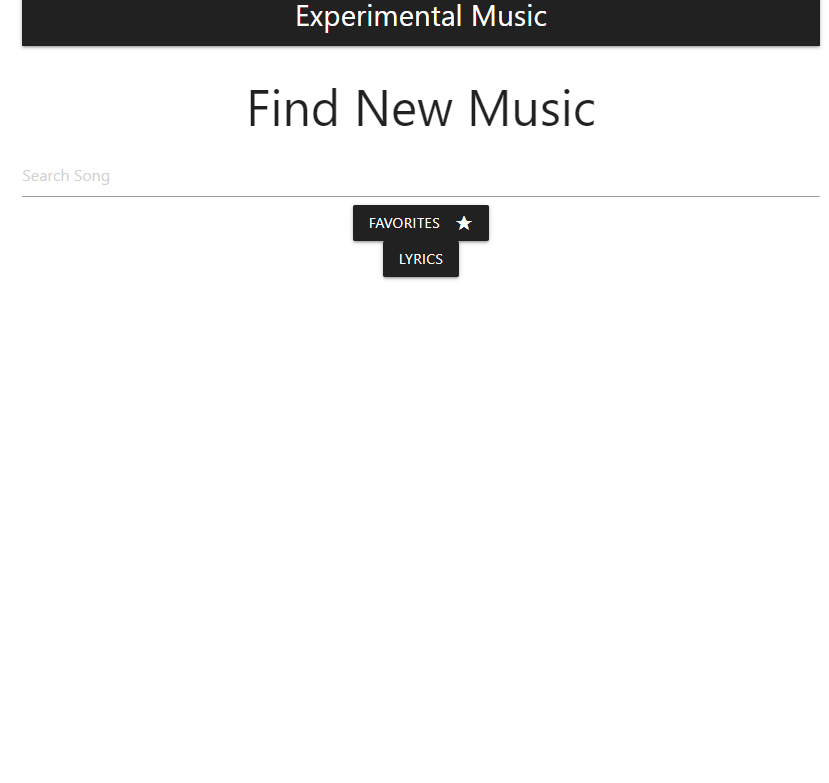
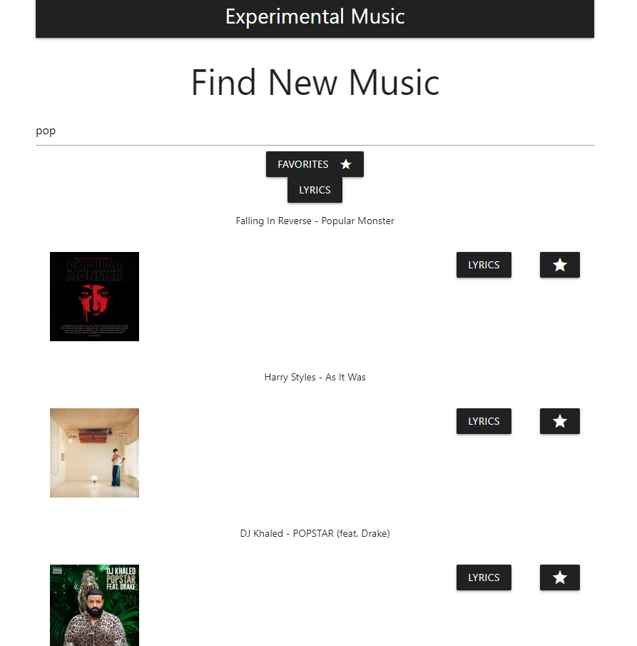
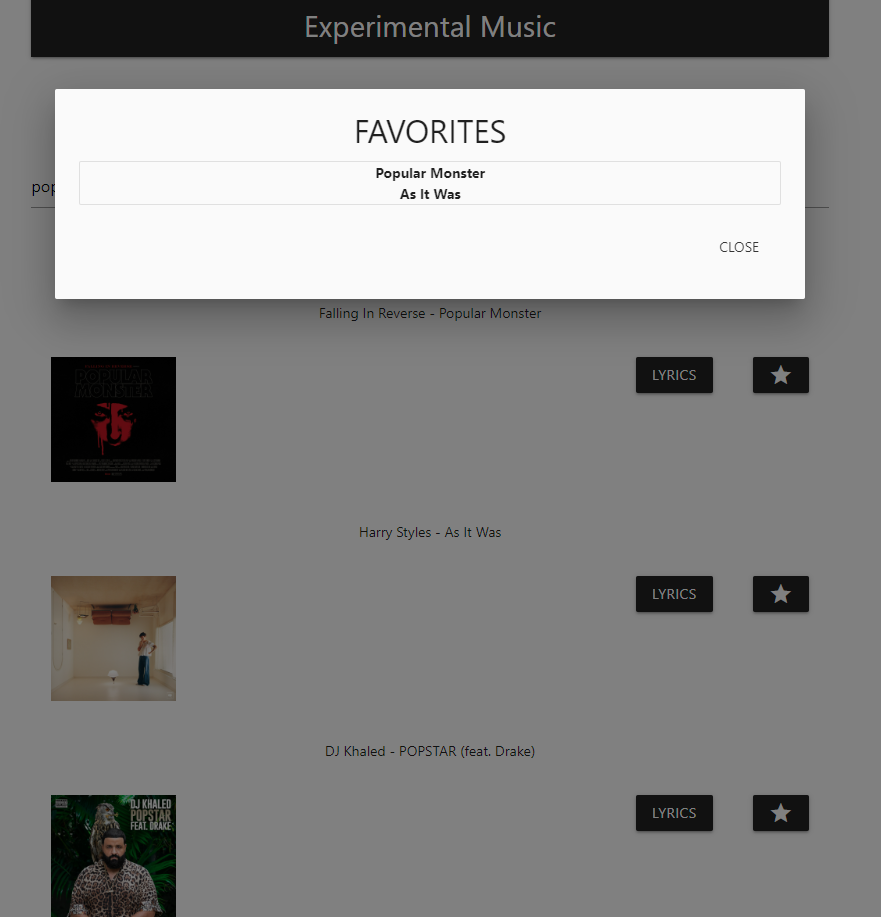
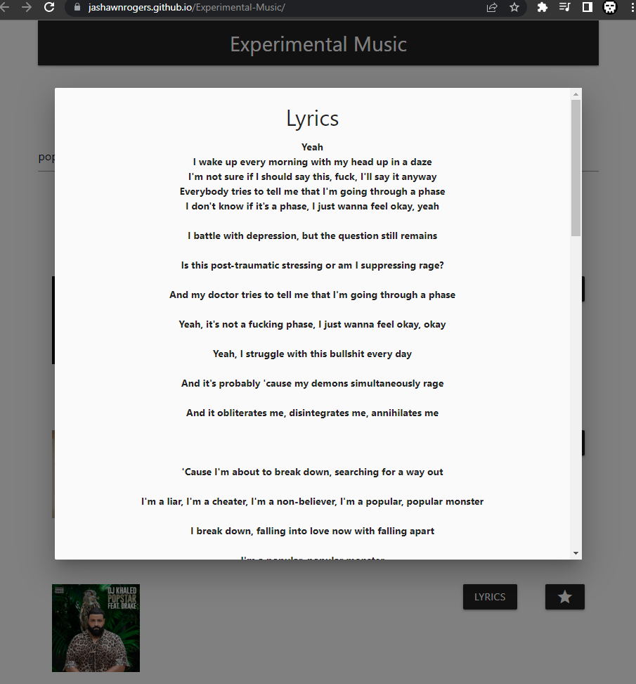

---

# EXPERIMENTAL MUSIC - Jashawn Rogers, Trey Bach

     AS A music enthusiast
     I want new music to try out.
     So that I could find new music to listen to.

We wanted to find the option to be able to find new music and this is the solution that Jashawn and Trey came up with.

* All you have to do is simply look up a keyword that you like for any song in the search bar in the HomePage Picture.

* Then you would simply search and you would get such results.

* You can either look up the lyrics by pressing the lyric button which will then pull a modal with the lyrics for the song. 

* You can also favorite it so if you have to refresh for whatever reason you can still have the songs that you liked from the previous visit! All you have to do is press favorites and it will pop up the song name!

* Technology Used: JQuery, Vanilla JS, Materialize CSS, HTML

**Live Page: https://jashawnrogers.github.io/Experimental-Music/**

